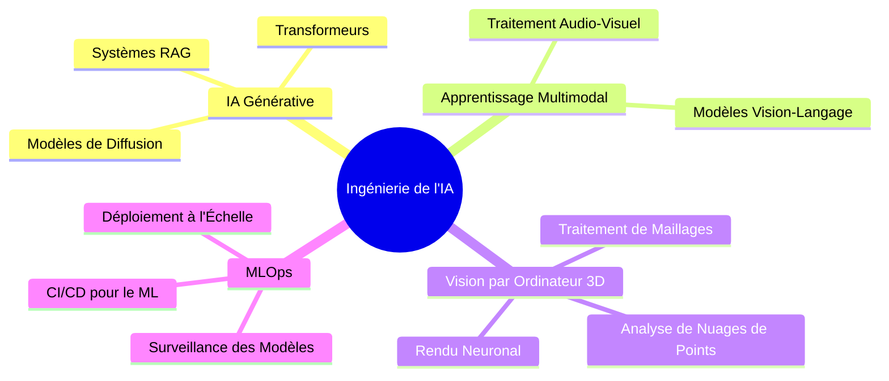

 **Salut, je suis OURTI ABDELILAH**
 

 
## IA Engineering|Data Scientist | Data Analyst
 

  
  
 

 
------------
##  Étudiant en Ingénierie de l'Intelligence Artificielle
 
 à Berkane, au Maroc.
 
Je me spécialise en **Data Science**, **Machine Learning**, **Deep Learning** et **Vision par Ordinateur**. Je porte également un vif intérêt au **Traitement du Langage Naturel (NLP)** ainsi qu'aux **Grands Modèles de Langage (LLMs)**.
 
Je m'intéresse également au **MLOps** et à l’**IA Responsable**, avec pour objectif de contribuer au développement de solutions d’intelligence artificielle innovantes et éthiques.
 
 
------------
## Objectif actuel:
Je vise à **développer des solutions IA** éthiques et durables, avec un fort accent sur la **responsabilité** et l’**impact social** des technologies que nous créons.
 

------------------------------------------
## Compétences et Technologies
 
 

Programming Languages

 

AI/ML Frameworks

 

Computer Vision & NLP

 

MLOps & Cloud

 

3D & Graphics Tools

 
--------------------------------------------------------------
 
<h2>Mes Projets</h2>
 
N'hésite pas à explorer mes projets et à me contacter pour toute opportunité !
 
 

  🔷 <strong> Data Scientist - OpenClassrooms / CentraleSupélec</strong>

 
<ul>
<li align="left"><a href="https://github.com/Abdelilah04116/Construisez-un-mod-le-de-scoring"><strong> Projet 4 : La Construction d'un modèle de scoring</strong></a></li>
<li align="left"><a href="https://github.com/Abdelilah04116/Segmentez_des_clients_d_un_site_ecommerce"><strong> Projet 5 : La Segmentation des clients d'un site e-commerce</strong></a></li>
</ul>
 

  🔷 <strong> Les Projets Académiques</strong>

 
<ul>
<li align="left"><a href="https://github.com/Abdelilah04116/fake-and-real-news-Classification-"><strong> La Construction un modèle de classification des actualités </strong></a></li>
<li align="left"><a href="https://github.com/Abdelilah04116/RAG_Project"><strong>RAG Application</strong></a></li>
<li align="left"><a href="https://rl-projet.onrender.com"><strong> Simulateur d'Atelier avec Apprentissage par Renforcement </strong></a></li>
</ul>
 
 
------------
## Analytique GitHub
 
 

<!-- Animated Trophy Display -->

 

<!-- Activity Graph -->

